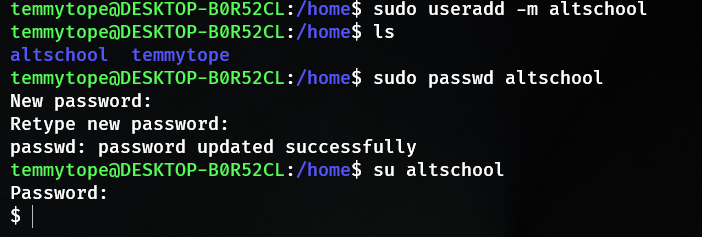
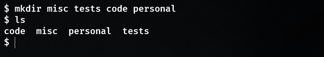
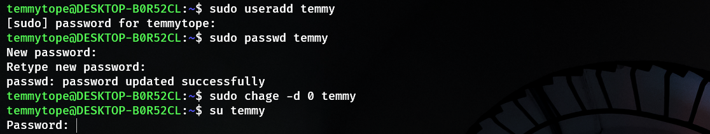
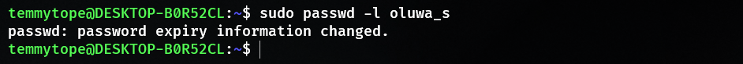
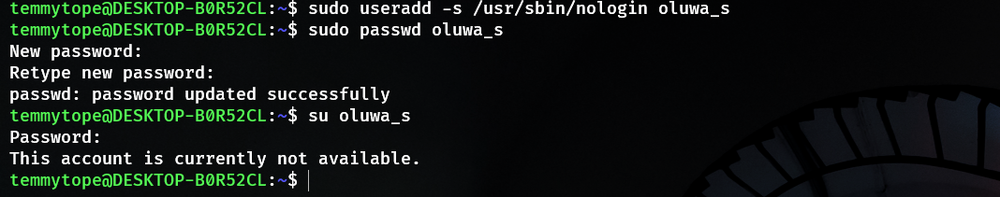

# ALTSCHOOL ASSIGNMENT

## Create a new user with the login altschool. The home directory have the sub-directories: code, tests, personal and misc

```text
    sudo useradd -m altschool
    sudo passwd altschool
    su altschool
    mkdir code tests personal misc
```





## a. change directory to test directory using absolute pathname

```shell
    cd /home/altschool/tests
```

## b. Change directory to test directory using absolute pathname

```shell
    cd ./tests
```

## c. Use echo command to create a file named fileA with text content ‘Hello A’ in the misc directory

```shell
    echo "Hello A" > ./misc/fileA
```

## d. Create an empty file named fileB in the misc directory. Populate the file with a dummy content afterwards

```shell
    touch ./misc/fileB
    echo "Hello FileB" >> ./misc/fileB
```

## e. Copy contents of fileA into fileC

```shell
   cp ./misc/fileA ./misc/fileC 
```

## f. Move contents of fileB into fileD

```shell
   mv ./misc/fileB ./misc/fileD
```

## g.Create a tar archive called misc.tar for the contents of misc directory

```shell
   tar -cvf misc.tar misc 
```

## h. Compress the tar archive to create a misc.tar.gz file

```shell
    gzip misc.tar
```

## I. Create a user and force the user to change his/her password upon login

```shell
    sudo useradd temmy
    sudo passwd temmy
    sudo chage -d 0 temmy
    su temmy
```



## J. Lock a users password

```shell
    sudo passwd -l oluwa_s
    su temmy
```



## K. Create a user with no login shell

```shell
    sudo useradd -s /usr/sbin/nologin oluwa_s
    sudo passwd oluwa_s
    su oluwa_s
```



## L. Disable password based authentication for ssh

## M. Disable root login for ssh
