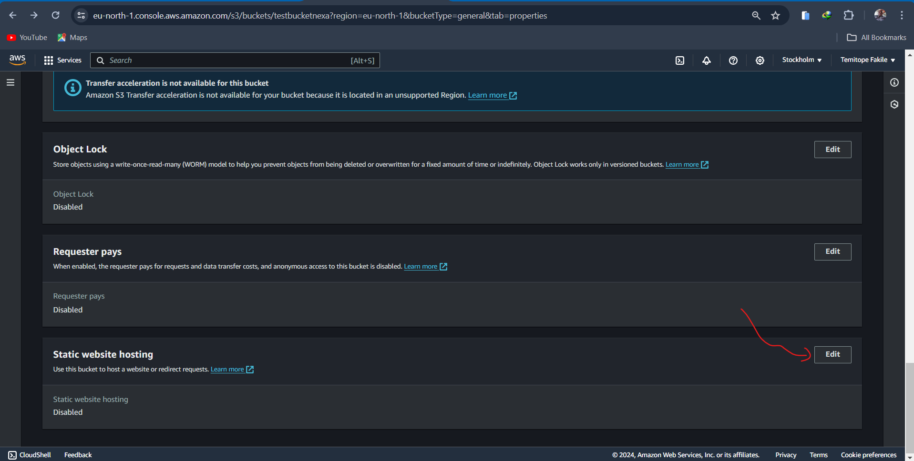

# OBJECTIVES

1. Create a static website host on S3 bucket (private bucket)
2. Set the policy of the policy of the bucket to public read using cloudfront for CDN

## Pre-requisite

1. AWS account.
2. Basic Knowledge of AWS services and console
3. A static website ready to be hosted

## INTRODUCTION

In the digital age, hosting a website has become easier than ever, thanks to cloud services like Amazon Web Services (AWS). This article will guide you through the process of securely hosting a static website on an Amazon S3 bucket with access restricted to CloudFront, providing enhanced security and performance

### STEP 1: Create an S3 Bucket

1. Login to you AWS account and click on S3 on the console

2. On the Amazon S3 home, click on create bucket

3. The bucket name must be unique globally on AWS.

4. Leave other setting as default and click on create bucket.

5. Click on the bucket created and upload the files of the static site.

6. In the bucket properties, find the “Static website hosting” option and click on edit.

7. Select “Use this bucket to host a website” and specify the index (index.html) and error (optional) documents and save changes.

### STEP 2: Configure the cloudfront

1. On the AWS console click on the cloudfront.
2. Click on create a cloudfront distribution.

3. Enter the bucket name created in the origin domain and set the origin access to "origin access control setting.

4. Click on create new OAC and enter the bucket name, leave others as default and click on create

5. Under the web aplication firewall, click on the "do not enable the security protection".

6. Enter "index.html" in the default root object.

7. leave other options as default and click on create distribution.

8. On the redirected page click on "copy policy" to copy the policy.

### STEP 3: Set the S3 Bucket policy

1. In the permission Tab of the S3 bucket created, go to the policy section and click on edit.
2. Paste the policy copied and save changes.

Copy the cloudfront distriibution domain name and paste in your browser to access the static website.

