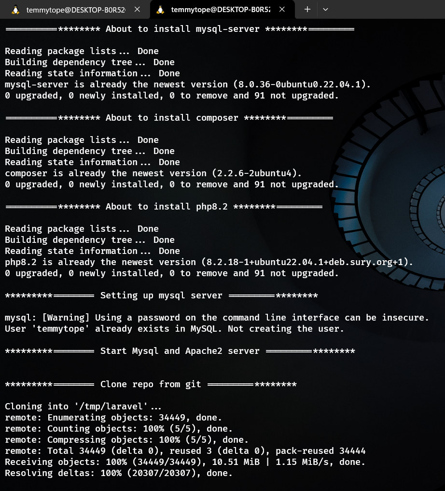
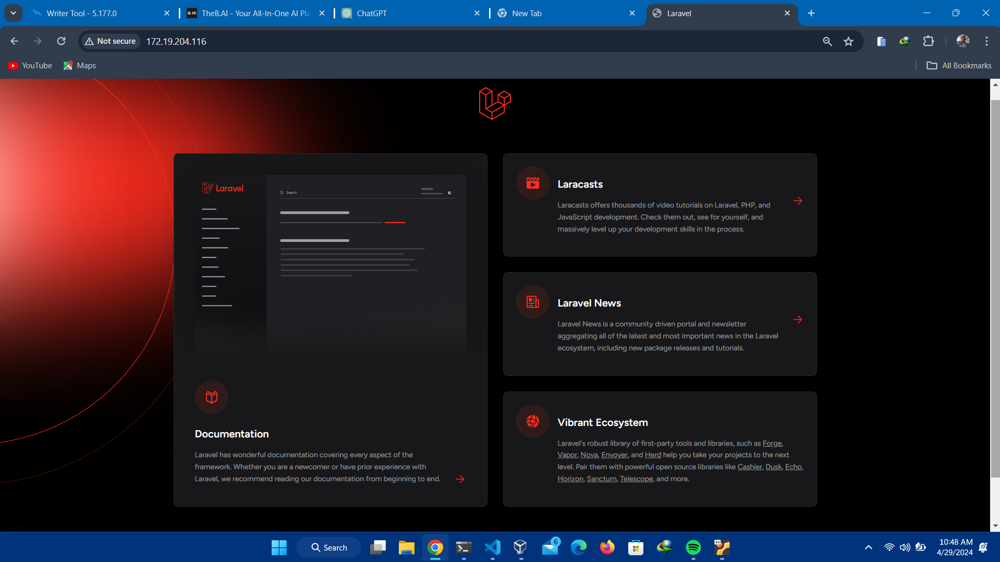

# PROJECT: DEPLOY A LAMP STACK APPLICATION

## OBJECTIVES

* Automate the provisioning of two Ubuntu-based servers, named “Master” and “Slave”, using Vagrant.
* On the Master node, create a bash script to automate the deployment of a LAMP (Linux, Apache, MySQL, PHP) stack.
* This script should clone a PHP application from GitHub, install all necessary packages, and configure Apache web server and MySQL
* Ensure the bash script is reusable and readable.
* Using an Ansible playbook:
    1. Execute the bash script on the Slave node and verify that the PHP application is accessible through the VM’s IP address (take screenshot of this as evidence)
    2. Create a cron job to check the server’s uptime every 12am
    3. Use either the VM’s IP address or a domain name as the URL

## PREREQUISITES

1. Two Ubuntu Servers. (A slave server and a master server)
2. Ansible must be installed on the master server

## STEPS

### 1. SSH into the 'slave' server and create a user with passwordless sudo privileges on all operations

    ```shell
        ssh osboxes@123.12.45.789
        sudo useradd -m temmytope
        sudo passwd temmytope
        sudo visudo /etc/sudoer
    ```


### 2. Run the script on the master server

    ``` shell
        ./script
    ```




The image below shows the result using the master server IP as URL



### 3. Run the playbook on the master server the to automate  the deployment to the 'slave' server

    ``` shell
        ansible-playbook -i inventory.ini scriptPlaybook.yaml
    ```


The image below shows the result using the master server IP as URL


